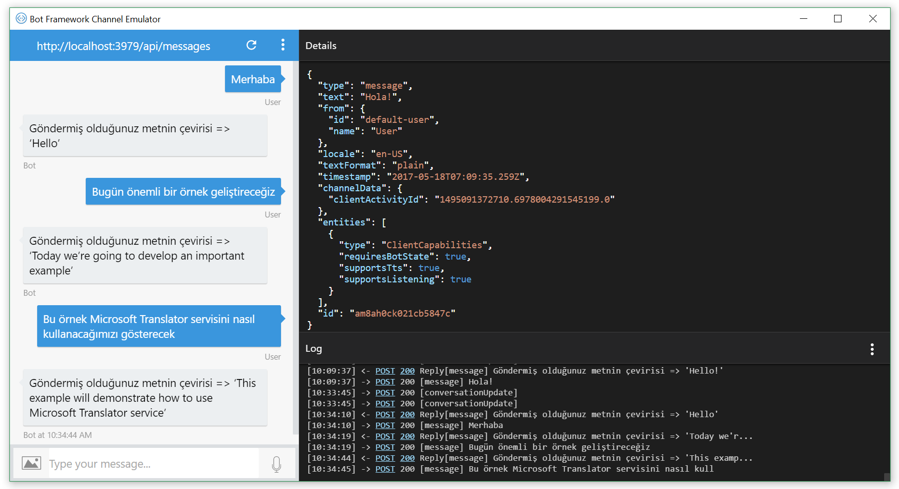
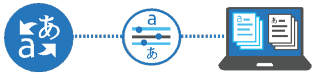
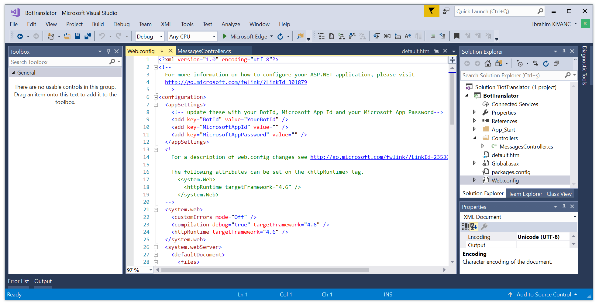
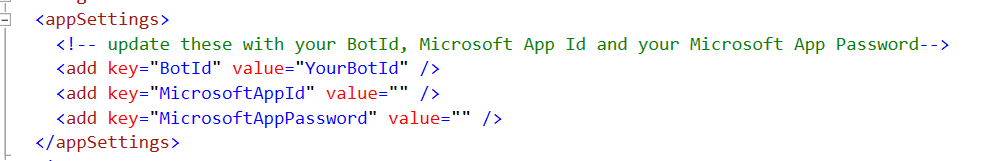
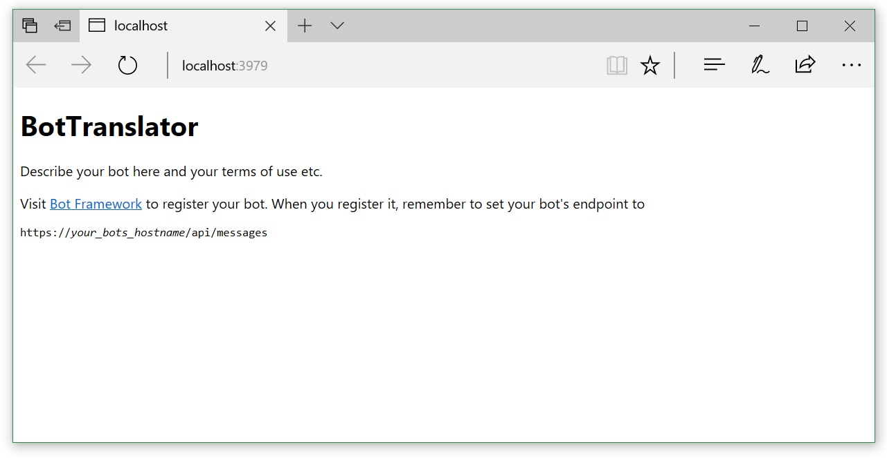

# BotTranslator - Microsoft Translator with Microsoft Bot Framework

Bots are the new apps, and bots're becoming trend day by day in our daily life. Developers consider this platform for consumer and commercial usage to reach their users via social media or through a Line Of Business (LOB) applications using embedded bots.

Native language support is an essential key point for such experiences provides Natural User Interface (NUI) for last users like chatbots. In this sample we'll learn how to use Microsoft Translator in a Bot Framework Application.




In this demo I used "TR>EN" translation, Turkish as native language and English as target language.

[![Deploy to Azure][Deploy Button]][Deploy BotTranslator]

[Deploy Button]: https://azuredeploy.net/deploybutton.png
[Deploy BotTranslator]: https://azuredeploy.net

## Microsoft Translator Text API
To use translator in or bot service we'll use Microsoft Translator Text API. Microsoft Translator APIs can be seamlessly integrated into your applications, websites, tools, or other solutions to provide multi-language user experiences. Leveraging industry standards, it can be used on any hardware platform and with any operating system to perform language translation and other language-related operations such as text language detection or text to speech. [Click Here](https://www.microsoft.com/en-us/translator) for more information about the Microsoft Translator API


 

### Getting Started to use Microsoft Translator API
To access the Microsoft Translator Text API you will need to sign up for Microsoft Azure. Follow these steps.
1. Sign up for a Microsoft Azure account at [http://azure.com](http://azure.com)
1. After you have an account go to [http://portal.azure.com](http://portal.azure.com)
1. Select the + **New** option.
1. Select **AI + Cognitive Services** from the list of services.
1. Click **See All** on top right.
1. Select **Translator Text API**.
1. Select the **Create** button.
1. Fill out the rest of the form. 
1. In the **Pricing Tier** section select the pricing tier that fits your needs.
1. Select the **Create** button.
1. You are now subscribed to Microsoft Translator.
1. Go to **All Resources** and select the Microsoft Translator API you subscribed to.
1. Go to the **Keys** option and copy your subscription key to access the service.

Paste this API Key into this "BotTranslator" sample in `MessagesController.cs`
```cs
    ...
     public class MessagesController : ApiController
     {
        string ApiKey = "PLACE YOUR MICROSOFT TRANSLATOR API KEY HERE";
        string targetLang = "en";
    ...
```

## Prerequisites to build a new Bot using Bot Framework Application
This is a step-by-step guide to writing an Bot in C# using the Bot Framework Connector SDK .NET template.

1. Install prerequisite software
    * Visual Studio 2015 or Visual Studio 2017  - you can download the community version here for free: [http://www.visualstudio.com](http://www.visualstudio.com)
    * Important: Please update all VS extensions to their latest versions Tools -> Extensions and Updates -> Updates

2. Download and install the Bot Application template 
    * Download the file from the direct download link [here](http://aka.ms/bf-bc-vstemplate) :
    * **For VS2015**: Save the zip file to your Visual Studio 2015 templates directory which is traditionally in “%USERPROFILE%\Documents\Visual Studio 2015\Templates\ProjectTemplates\Visual C
    * **For VS2017**: Save the zip file to your Visual Studio 2017 templates directory which is traditionally in “%USERPROFILE%\Documents\Visual Studio 2017\Templates\ProjectTemplates\Visual C

3. Open Visual Studio

4. Create a new C# project using the new Bot Application template.


5. The template is a fully functional Echo Bot that takes the user’s text utterance as input and returns it as output. In order to run however, 
    * The bot has to be registered with Bot Connector
    * The BotID, MicrosoftAppID and MicrosoftAppPassword from the Bot Framework registration page have to be recorded in the project’s web.config
    * The project needs to be published to the web

## BotID, MicrosoftAppID and MicrosoftAppPassword
Bot has unique BotID, MicrosoftAppID and MicrosoftAppPassword whenever you publish to botframework.com, it comes with default settings like below. in order to test in your bot emulator you need to make sure BotID, MicrosoftAppID and MicrosoftAppPassword are ok.

 

## Build the sample Bot Project
1. If you download the samples ZIP, be sure to unzip the entire archive, not just the folder with the sample you want to build. 
2. Start Microsoft Visual Studio 2015 or 2017 and select **File** \> **Open** \> **Project/Solution**.
3. Starting in the folder where you unzipped the samples, go to the Samples subfolder, then the subfolder for this specific sample. Double-click the Visual Studio Solution (.sln) file.
4. Press Ctrl+Shift+B, or select **Build** \> **Build Solution**.

## Deploying and running bot endpoint
- To debug the bot sample and then run it, press F5 or select Debug >  Start Debugging. To run the sample without debugging, press Ctrl+F5 or select Debug > Start Without Debugging. After that you'll see below running bot endpoint.



## Running Bot Emulator
You can download Bot Emulator from [http://emulator.botframework.com](http://emulator.botframework.com)

After that Search "Microsoft Bot Framework Emulator" from your program and files. This will help you to test your bot endpoint before publishing it. It has a chatbot interface in order to test capabilities of your bot. And before adding a bot into conversation make sure your BotID, MicrosoftAppID and MicrosoftAppPassword are ok. Type your message and recieve the response from bot.


Have fun!